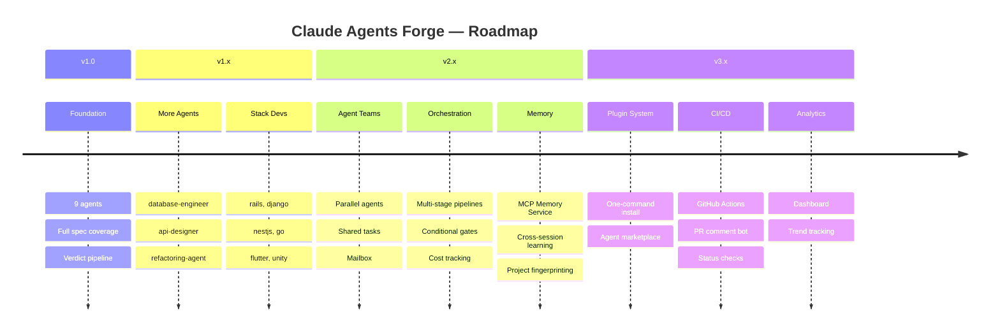
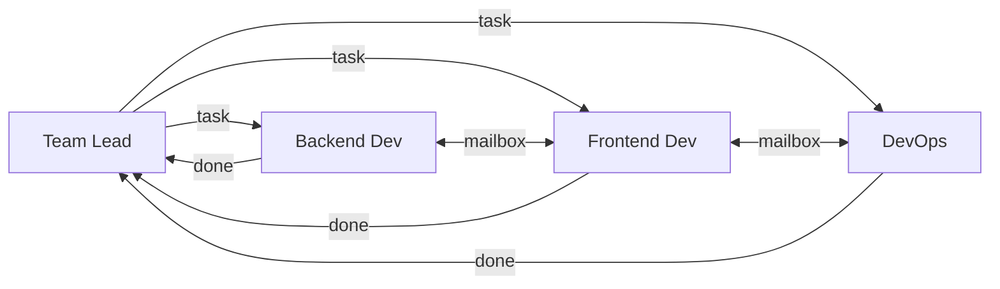
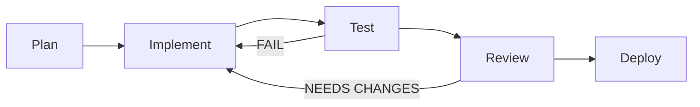
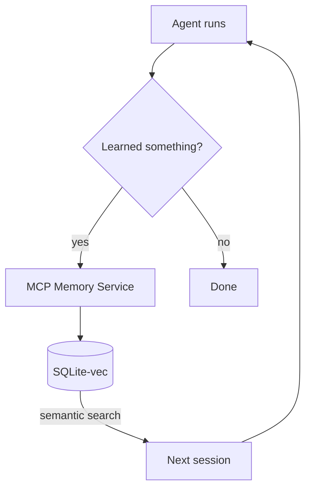
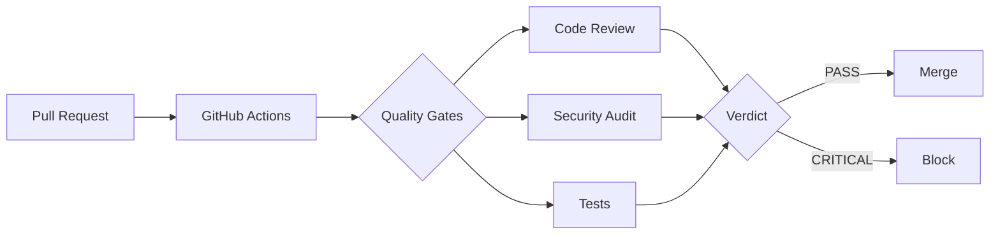

# Roadmap

> **Contributions welcome** — pick any item, [open an issue](https://github.com/Mationetap/claude-agents-forge/issues), submit a PR.

 

 

## v1.0 — Foundation 

> 9 production-hardened agents with full spec coverage

- [x] Conductor orchestrator (opus, 200 turns)
- [x] 5 quality agents — read-only enforcement via `disallowedTools`
- [x] 3 dev agents — backend, frontend, devops
- [x] Turn budgets + Bash timeout tables
- [x] Verdict-driven pipeline (PASS → CRITICAL)
- [x] Memory scopes — user / project / local
- [x] MCP first, Bash fallback pattern

 

## v1.1 — More Agents 

> Expand coverage without bloat — every agent earns its place

| Agent | Purpose |
|-------|---------|
| `database-engineer` | Schema design, migrations, query optimization, index analysis |
| `api-designer` | OpenAPI spec review, REST/GraphQL best practices, versioning |
| `refactoring-agent` | Code smell detection, extract method/class, dead code removal |
| `dependency-auditor` | Outdated packages, license compliance, vulnerability scanning |
| `i18n-reviewer` | Missing translations, hardcoded strings, locale consistency |
| `accessibility-auditor` | WCAG compliance, aria attributes, keyboard navigation |

 

## v1.2 — Stack-Specific Dev Agents 

> Fork `backend-dev.md`, customize for your stack

| Agent | Stack |
|-------|-------|
| `rails-dev` | Ruby on Rails — models, migrations, jobs, admin |
| `django-dev` | Python / Django |
| `nestjs-dev` | NestJS / TypeScript |
| `go-dev` | Go — net/http, gin, fiber |
| `flutter-dev` | Dart / Flutter mobile |
| `unity-dev` | C# / Unity game dev |

 

## v2.0 — Agent Teams 

> Parallel agents that talk to each other — not just to the conductor

- [ ] Agent Teams support (experimental Claude Code feature)
- [ ] Team Lead agent coordinating parallel dev agents
- [ ] Shared task list between teammates
- [ ] Direct mailbox communication between agents
- [ ] Conflict resolution for overlapping file changes

 

## v2.1 — Advanced Orchestration 

> Smarter pipelines, fewer wasted turns

- [ ] Multi-stage pipelines — plan → implement → test → review → deploy
- [ ] Conditional gates — skip security audit for CSS-only changes
- [ ] Parallel dev agents with file locking
- [ ] Retry policies — configurable count, exponential backoff
- [ ] Pipeline templates — presets for bug fix, feature, refactor
- [ ] Cost tracking — estimate token usage per pipeline run

 

## v2.2 — Memory & Learning 

> Agents that get smarter with every run

- [ ] **MCP Memory Service** — structured long-term memory (SQLite-vec, semantic search)
- [ ] **Memory-aware prompts** — consult memory before work, save findings after
- [ ] **Project fingerprinting** — auto-detect stack, conventions, config → persist
- [ ] **Cross-session learning** — remember patterns, past findings, recurring issues
- [ ] **Team knowledge base** — shared memory across quality agents
- [ ] **Memory scoping strategy** — guidelines for user / project / local
- [ ] **Auto-calibration** — adjust review depth based on past false positive rate
- [ ] **Pattern library** — reusable checklists per framework, stored in memory
- [ ] **Memory export/import** — share learned patterns between projects
- [ ] **Memory hygiene** — auto-cleanup of stale/conflicting memories, dedup
- [ ] **Onboarding memory** — first-run scan populates project structure & deps

 

## v3.0 — Plugin System 

> One-command install, community marketplace

- [ ] Package as Claude Code plugin (`plugin.json` manifest)
- [ ] One-command installation via plugin registry
- [ ] Settings UI for selecting which agents to enable
- [ ] Agent marketplace — community agents with ratings
- [ ] Plugin hooks for custom pre/post agent actions

 

## v3.1 — CI/CD Integration 

> Quality gates in your pipeline, not just your terminal

- [ ] **GitHub Actions** — run quality gates on PR
- [ ] **GitLab CI** — equivalent template
- [ ] **Pre-commit hook** — local quality check before push
- [ ] **PR comment bot** — post agent verdicts as review comments
- [ ] **Status checks** — block merge on CRITICAL verdicts
- [ ] **Diff-only mode** — review only changed lines

 

## v3.2 — Reporting & Analytics 

> See how your code quality evolves

- [ ] HTML report — visual quality report with charts
- [ ] Trend tracking — quality score over time
- [ ] Verdict history — track recurring issues
- [ ] Agent performance metrics — turns, time, accuracy
- [ ] Dashboard — web UI for monitoring runs

 

## Ongoing

> Continuous improvements across all versions

- [ ] Turn budget optimization (measure actual usage per phase)
- [ ] More MCP servers — Prettier, Biome, Ruff, mypy, Clippy
- [ ] Windows-native improvements (PowerShell compatibility)
- [ ] Agent prompt compression (reduce tokens without losing quality)
- [ ] Benchmark suite — reproducible test cases for agent quality
- [ ] Multilingual docs — Russian, Chinese, Japanese, Spanish

 

---

  <b>Want to contribute?</b> 
  Pick any item, <a href="https://github.com/Mationetap/claude-agents-forge/issues">open an issue</a>, submit a PR. 
  See <a href="CONTRIBUTING.md">CONTRIBUTING.md</a> for quality standards.

